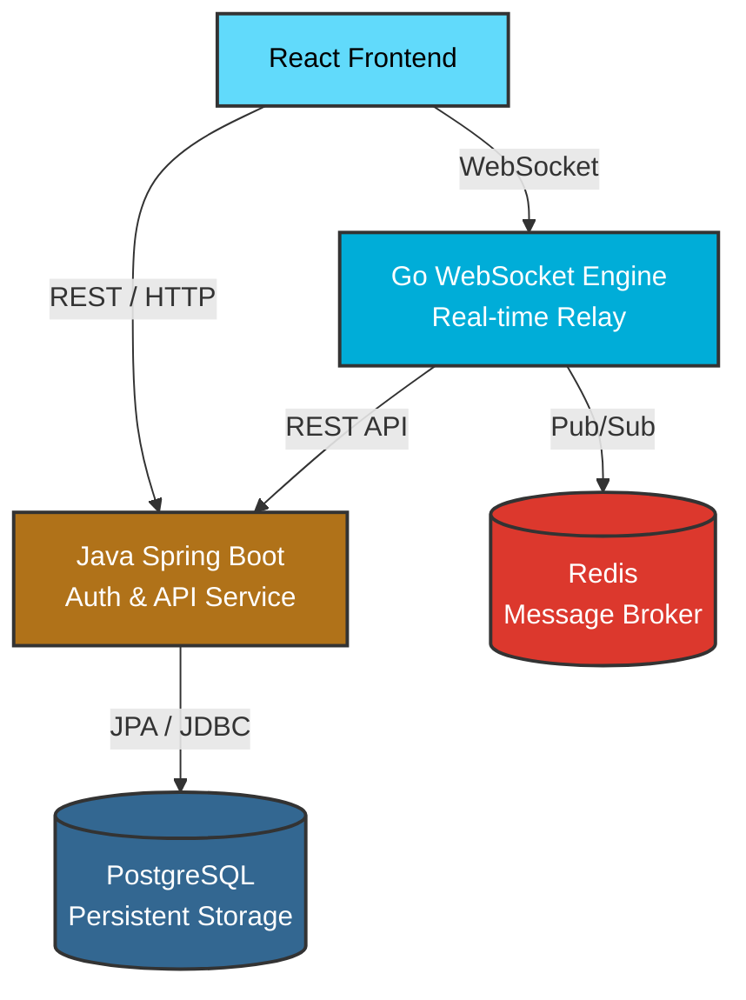

# NexChat — Distributed Real-Time Chat System

A production-grade, distributed real-time chat application built as a showcase of scalable architecture, polyglot microservices, and modern web development.

This project is not a simple monolith or CRUD app; it demonstrates the patterns used by platforms like Slack, Discord, and WhatsApp to handle high concurrency, stateful connections, and secure data persistence.

---

## 🌍 The Big Picture

NexChat splits responsibilities across specialized components, forming a distributed system:
- **Java (Spring Boot)** handles the heavy lifting of security, data integrity, and REST APIs.
- **Go** handles the high-concurrency, low-latency WebSocket connections.
- **React** provides a snappy, single-page application experience.
- **Redis** and **PostgreSQL** handle real-time messaging distribution and persistent storage.

---

## 🏗️ System Architecture



### Component Breakdown

#### 1. React Frontend (Port 5173)
The user interface. It communicates with the Java service via standard HTTP REST calls for things like login, registration, and loading chat history. Once authenticated, it opens a persistent WebSocket connection to the Go service to send and receive messages in real-time.

#### 2. Java Spring Boot Service (Port 8080)
The "Source of Truth." Responsibilities include:
- **Identity:** User registration, password hashing (BCrypt), and JWT generation (HMAC-SHA256).
- **REST APIs:** Providing endpoints for profile management, friend requests, and paginated chat history.
- **Persistence:** Interacting with PostgreSQL using Spring Data JPA.
- **Security:** Guarding the system with a stateless Spring Security 6 filter chain and Bucket4j rate limiting.

#### 3. Go WebSocket Engine (Port 8081)
The "Real-Time Router." Go is famous for its concurrency model (Goroutines), making it the perfect language for handling tens of thousands of simultaneous WebSocket connections with very low memory overhead. Responsibilities include:
- Maintaining live WebSocket connections.
- Routing messages from a sender immediately to a receiver.
- Broadcasting "user is typing..." or "user is online" events.

#### 4. PostgreSQL Database (Port 5432)
The permanent storage layer. It holds users, hashed passwords, session refresh tokens, the friendship graph, and every chat message ever sent. Schema evolution is managed strictly using **Flyway migrations**.

#### 5. Redis Pub/Sub (Port 6379)
The "Scale-Out" layer. If User A is connected to Go Server #1, and User B is connected to Go Server #2, how does a message get from A to B? 
Go Server #1 publishes the message to Redis. Redis broadcasts it to all other Go servers. Go Server #2 sees the message and pushes it down the WebSocket to User B. This allows the system to scale horizontally by running infinite instances of the Go service.

---

## 🔄 Data Flow: Sending a Message

To understand why the system is built this way, let's trace what happens when Alice sends a message to Bob:

1. **Authentication:** Alice logs in via the **Java** service and gets a JWT (JSON Web Token).
2. **Connection:** Alice's React app uses that JWT to open a WebSocket connection to the **Go** service.
3. **Dispatch:** Alice types "Hello" and hits send. The message goes over the WebSocket to the **Go** service.
4. **Relay & Persist:** The **Go** service:
   - Immediately routes the message to Bob's WebSocket (if he is online).
   - Publishes the message to **Redis** (in case Bob is connected to a different server instance).
   - Makes a fast, internal HTTP call to the **Java** service to save the message into **PostgreSQL**.
5. **Delivery:** Bob receives the message on his screen instantly. His client sends a "Delivered" receipt back through the WebSocket, updating the database.

---

## 🧠 Key Engineering Patterns

- **Polyglot Engineering:** Using the right tool for the job (Java for business logic/data integrity, Go for high-concurrency I/O).
- **Stateless Auth:** Proper JWT usage with separate short-lived access tokens (15m) and revocable refresh tokens (7d).
- **Horizontal Scalability:** Designing a system that doesn't break when you spin up 5 copies of the server behind a load balancer (thanks to Redis Pub/Sub and stateless APIs).
- **Clean Architecture:** Strict separation of concerns (DTOs, Repositories, Controllers, Services).
- **Database Migrations:** Version-controlled schema management using Flyway.
- **API Envelope Pattern:** Consistent, structured JSON responses for every endpoint.

---

## 🛠️ Tech Stack Overview

- **Frontend:** React 18, TailwindCSS, Axios, Native WebSockets, Vite
- **Java Backend:** Java 23, Spring Boot 3.3, Spring Security 6, Spring Data JPA, Hibernate, JJWT, Bucket4j, Flyway, Maven
- **Go Backend:** Go (latest), Gin, Gorilla WebSocket, go-redis
- **Data:** PostgreSQL 16, Redis 7
- **DevOps:** Docker, Docker Compose, Nginx, GitHub Actions

---

## 🚀 Development Quick Start

The project relies on Docker Compose for infrastructure and a `Makefile` for developer convenience.

### Prerequisites
- Docker & Docker Compose
- Java 23 (or Java 21 LTS)
- Maven 3.9+
- Go 1.22+
- Node.js 20+ & npm

### Commands

```bash
# Start the database and redis containers
make db-up

# Stop and remove containers
make db-down

# Compile the Java service
make java-build

# Run the Java service locally
make java-run

# Run Java unit tests
make java-test

# Clean build artifacts
make clean
```
